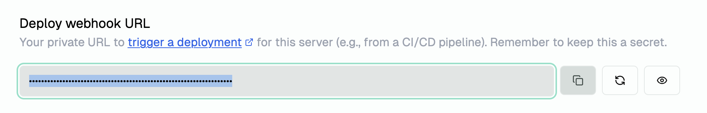

# Auto-deploy to zaneops 

This action is used to deploy docker services automatically to a ZaneOps instance on git push.

## Example usage

```yaml
uses: zane-ops/auto-deploy-action@v4
with:
  SERVICE_IMAGE: ghcr.io/fredkiss3:fredkiss-dev:${{ github.sha }}
  DEPLOY_WEBHOOK_URL: ${{ secrets.DEPLOY_WEBHOOK_URL }}
  COMMIT_MESSAGE: ${{ github.event.head_commit.message }}
```

This action is better used with the [`docker/build-push-action`](https://github.com/docker/build-push-action) action to build a version of your image based on the commit sha. A more real-life github action workflow would look like this : 

```yaml
name: ci

on:
  push:

jobs:
    build-push-app:
        name: Build and Push zaneops docs
        runs-on: ubuntu-latest
        permissions:
            packages: write
            contents: read
            attestations: write
            id-token: write
        steps:
            - name: Checkout
              uses: actions/checkout@v4
            - name: Set up Docker Buildx
              uses: docker/setup-buildx-action@v2
            - name: Log in to the Container registry
              uses: docker/login-action@65b78e6e13532edd9afa3aa52ac7964289d1a9c1
                with:
                    registry: ghcr.io
                    username: ${{ github.actor }}
                    password: ${{ secrets.CONTAINER_REGISTRY_PAT }}
            - name: Build and push
              uses: docker/build-push-action@v3
              with:
                context: ./
                file: ./
                push: true
                tags: ghcr.io/zane-ops/docs:latest,ghcr.io/zane-ops/docs:${{ github.sha }}
                cache-from: type=registry,ref=ghcr.io/zane-ops/docs:latest
                cache-to: type=inline
            - name: Deploy to Zaneops
              uses: zane-ops/auto-deploy-action@v4
              with:
                SERVICE_IMAGE: ghcr.io/zane-ops/docs:${{ github.sha }}
                DEPLOY_WEBHOOK_URL: ${{ secrets.DEPLOY_WEBHOOK_URL }}
                COMMIT_MESSAGE: ${{ github.event.head_commit.message }}
```

## Inputs

### `DEPLOY_WEBHOOK_URL`

**Required** The url to deploy your app, you can copy this from your dashboard, if you go to your service settings : 


> [!WARNING]
> Please keep this value secret as this url is unauthenticated. If this url has been compromised, you can still regenerate it in the dashboard, invalidating the previous url.

### `SERVICE_IMAGE`

An optional docker image tag to deploy, it's recommended to use the image with the commit sha as the tag, but you can also pass the same image as the one you specified when you created the service. it won't complain.

### `COMMIT_MESSAGE`
 
An optional custom commit message associated with the new deployment that will be created.

### `EXTRA_HEADERS`
 
Optional extra headers to pass to all the requests encoded as JSON. ex: `{"Authorizaton": "Bearer ey2f4o3nl94k"}`.
This is particularly useful if your zaneops dashboard is behind an external authenticated page which requires other headers to pass.